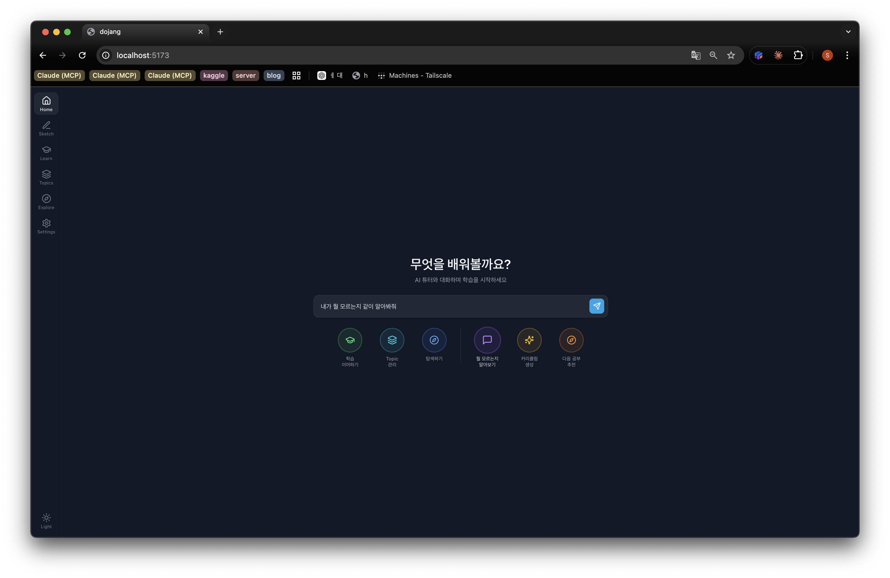
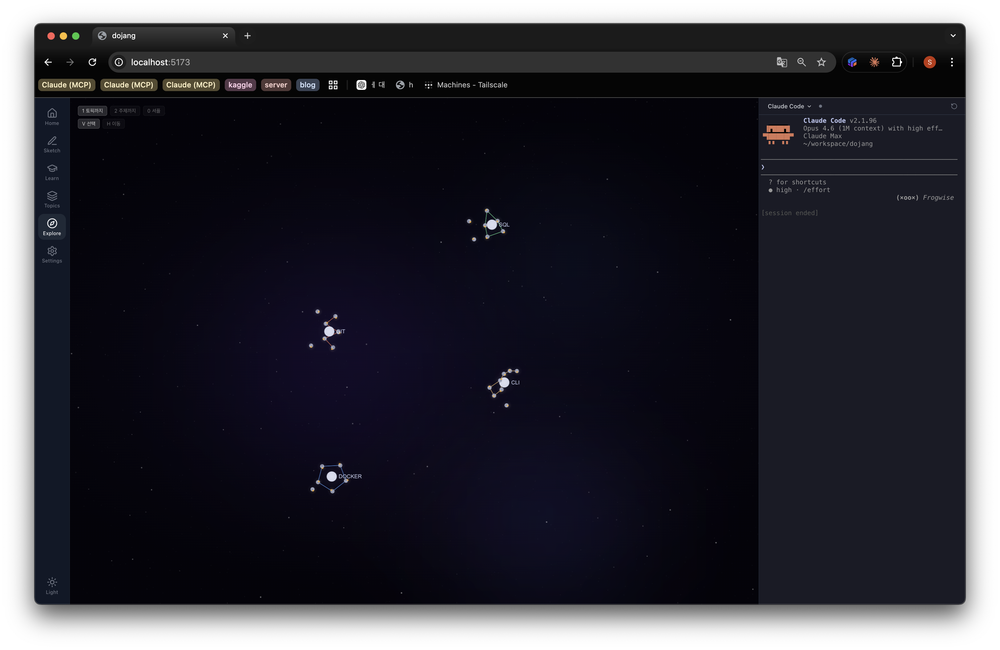

# dojang

Claude Code와 대화하며 별자리처럼 자라나는 개인 학습 공간.




## What is this?

**dojang**(道場, training hall)은 학습 이력을 별자리로 시각화하고, **로컬에 설치된 Claude Code 세션**과 직접 대화하면서 자기만의 커리큘럼을 키워가는 개인 학습 플랫폼입니다.

- **외부 AI API 의존 없음** — OpenAI/Anthropic SDK 호출이 전혀 없습니다. 모든 대화는 사용자 머신에 설치된 `claude` CLI를 통해 이루어집니다. API 키 / 사용량 / 비용 걱정 없이 자기 환경 안에서 동작합니다.
- **별자리로 된 지식맵** — 각 토픽이 진짜 별자리(Orion, Big Dipper, Cassiopeia 등)의 모양을 빌려 4개의 cluster로 흩어집니다. 학습이 진행될수록 별이 밝아집니다.
- **도메인 컨테이너에서 실제 도구 실행** — CLI/Git/Docker/SQL 등 각 토픽마다 격리된 Docker 컨테이너가 떠 있어, 학습 중 실제 명령을 그대로 돌릴 수 있습니다.
- **Sketch — 산파법 낙서장** — 자유 메모와 Claude Code 터미널이 한 화면에. Claude는 대화 중 핵심을 sketch에 자동으로 기록하도록 유도됩니다.
- **Topics를 cluster로 정리** — 학습 토픽을 자기만의 cluster(예: "기초 도구", "데이터")로 묶어 관리합니다.
- **개인 데이터는 100% 로컬** — 학습 이력, sketch, 시도는 `data/dojang.db` SQLite에만 들어가고 git에는 절대 안 들어갑니다.

## Quick Start

**필수 설치:** Docker.

```bash
git clone https://github.com/000namc/dojang.git && cd dojang
cd build && docker compose up -d
```

브라우저에서 **http://localhost:8010** 열기.

처음 부팅하면 빈 DB를 감지하고 `build/{topic}/curriculum.json` 시드를 자동으로 채웁니다 (CLI / Git / Docker / SQL).

> **첫 실행 시 Claude 로그인 한 번**:
> ```bash
> docker exec -it dojang-app claude /login
> ```
> 호스트의 `~/.claude/` 와 `~/.claude.json` 이 컨테이너에 마운트되어 있어서, 한 번 로그인하면 토큰이 호스트 파일에 떨어지고 컨테이너 재시작 후에도 영속됩니다. macOS 는 자격증명이 keychain 에 있어서 자동 인계가 안 되기 때문에 OAuth 흐름이 한 번 필요하고, Linux 는 보통 호스트의 `~/.claude/.credentials.json` 이 그대로 공유돼서 즉시 동작합니다.

### 컨트리뷰터: 핫리로드

백엔드는 default 로 `src/backend/` 가 컨테이너에 bind mount + `uvicorn --reload` 라서 호스트에서 코드를 바꾸면 자동으로 반영됩니다. 별도 설정 없이 그냥 편집하면 됨.

프론트엔드를 자주 만지는 경우엔 빌드 산출물 대신 vite dev server 가 필요합니다:
```bash
(cd src/frontend && npm install && npm run dev)   # http://localhost:5173
```
프론트는 5173, 백엔드 API 는 여전히 8010 으로 프록시됩니다.

## Tabs

### 🏠 Home
짧은 인사말 + 입력창. 입력 후 엔터하면 새 sketch가 생성되어 Sketch 탭으로 이동합니다.

### ✏️ Sketch
좌측: sketch 목록 / 중앙: 마크다운 에디터 / 우측: **이 sketch 전용 Claude Code 세션**.

각 sketch는 `claude --resume <session-id>` 로 자기만의 세션을 영구적으로 갖습니다. 다음 번에 sketch를 열면 Claude가 그때까지의 대화 맥락을 기억한 채로 돌아옵니다.

### 🎓 Learn
선택한 토픽의 커리큘럼 트리에서 노트(📖)와 실습(✏️)을 골라 학습합니다. 우측 글로벌 Claude Code 도크에서 바로 질문할 수 있습니다.

### 📦 Topics
좌측 cluster 사이드바 + 우측 토픽 그리드. cluster를 만들어 토픽을 분류하고, 각 토픽의 대표 curriculum을 지정합니다. 새 토픽은 기본 cluster로 자동 들어갑니다.

### 🔭 Explore
지금까지 쌓아온 별자리. 4개 토픽이 cluster로 흩어지고, subject가 별로 박힙니다. 토픽을 끌면 BFS depth에 따라 근처 별이 자석처럼 따라옵니다.

**단축키:**
- `1` — 토픽 라벨만 / `2` — +주제 라벨
- `0` — 별자리 셔플 (다른 별자리 패턴으로 재배치)
- `V` — 선택 모드 (기본) / `H` — 손바닥 모드 (드래그 = 카메라 이동)

## Built-in Domains

| Domain | What you practice |
|--------|-------------------|
| **CLI** | bash, grep, sed, awk, find, jq |
| **Git** | branch, merge, rebase, conflict resolution |
| **Docker** | images, containers, Dockerfile, compose |
| **SQL** | SELECT, JOIN, GROUP BY, subqueries (MySQL) |

## 내 데이터는 어디에 있는가

Dojang은 사용자 머신 안에서만 동작합니다. 어떤 데이터도 외부 서버로 나가지 않습니다.

| 무엇 | 어디에 | 누가 손대는가 | git 추적 |
|---|---|---|---|
| **샘플 데이터** (시드 커리큘럼) | `build/{cli,git,docker,sql}/curriculum.json` + `knowledge.json` | 빈 DB일 때 `seed_if_empty()`가 한 번 읽어서 SQLite에 복사. 이후 절대 안 건드림 | ✅ 커밋 |
| **개인 학습 이력** | `data/dojang.db` (SQLite) | 백엔드 라우터들이 INSERT/UPDATE | ❌ `.gitignore` |
| **Sketch 본문** | `data/dojang.db` 의 `sketches` 테이블 | Sketch 탭 에디터 | ❌ `.gitignore` |
| **연습 시도 / 실행 결과** | `data/dojang.db` 의 `attempts` 테이블 | Learn 탭 / 컨테이너 실행 | ❌ `.gitignore` |
| **Claude Code 대화 세션** | `~/.claude/projects/<encoded-cwd>/<uuid>.jsonl` | `claude` CLI 자체 | ❌ home 디렉토리, 레포와 무관 |
| **API 키** | 없음 | — | — |
| **`.env`** | 프로젝트 루트 | 사용자 본인 | ❌ `.gitignore` |

### `git pull`로 업데이트해도 안전한가?

네. 새 시드 커리큘럼이 와도 `seed_if_empty()` 는 빈 DB일 때만 동작하므로 기존 학습 이력을 덮어쓰지 않습니다. `data/dojang.db` 는 git 추적 대상이 아니라 그대로 유지됩니다.

### 샘플 vs 개인 데이터의 분리

로컬에서 새 토픽을 만들거나 채팅으로 커리큘럼을 추가해도 그 변경은 `data/dojang.db` 에만 들어갑니다. `build/{topic}/*.json` 시드 파일은 절대 런타임에 기록되지 않습니다. 즉 자기 학습 데이터가 레포에 섞일 일이 없고, PR을 보낼 때 `git diff` 가 깨끗합니다.

### Docker volume

`data/` 는 named volume `dojang-data` 로 마운트되어 컨테이너 재시작에도 살아남습니다. 컨테이너 + 데이터까지 완전히 삭제하려면:
```bash
cd build && docker compose down -v
```

## Contributing

PR을 환영합니다. 가능한 기여 방향:

- **새 도메인 추가** — Rust, Go, Kubernetes, AWS CLI 등. [docs/domains.md](docs/domains.md) 의 가이드대로 `build/<topic>/` 디렉토리만 추가하면 됩니다.
- **별자리 패턴 추가** — `src/frontend/src/pages/Explore.tsx` 의 `CONSTELLATIONS` 배열에 stick figure 좌표를 더하면 됩니다 (현재 12개, 셔플 시 무작위로 4개 매핑).
- **MCP 도구 확장** — `src/backend/tools.py` 의 `TOOL_REGISTRY` 에 도구를 등록하면 Claude Code가 즉시 호출할 수 있습니다.
- **UI/UX 개선** — 접근성, 다크모드, 키보드 단축키 등.
- **버그 리포트 / 디자인 제안** — Issue 환영.

PR 가이드:
1. 레포 fork → feature 브랜치 생성
2. 변경 후 `cd src/frontend && npx tsc --noEmit` 로 타입체크
3. 가능하면 한 PR에 하나의 변경만 (작게)
4. 시드 데이터(`build/*/*.json`)를 바꾼다면 충돌 방지 차원에서 별도 PR로
5. 외부 AI SDK(`openai`, `anthropic`) import는 거부됩니다 — Dojang의 핵심 디자인 원칙입니다

빠른 질문이나 아이디어는 Issue에, 코드 변경은 PR로 부탁드립니다.

## License

[MIT](LICENSE) — 자유롭게 쓰고, 수정하고, 재배포하세요. 상업적 이용도 OK. 저작권 표시만 남겨주시면 됩니다.

## Tech Stack

FastAPI · React 19 · TypeScript · Tailwind CSS · sigma.js + graphology · xterm.js · Monaco Editor · Zustand · SQLite · Docker · Claude Code (MCP)

## Architecture (high level)

```
src/
├── backend/
│   ├── main.py               # FastAPI app
│   ├── database.py           # SQLite schema + migrations
│   ├── seed.py               # build/{topic}/*.json → DB on empty
│   ├── tools.py              # MCP tool registry (Claude Code가 호출)
│   ├── mcp_server/server.py  # MCP stdio server
│   └── routers/
│       ├── topics.py         # Topic CRUD
│       ├── clusters.py       # Topic cluster CRUD
│       ├── curriculum.py     # Curriculum CRUD
│       ├── knowledge.py      # Knowledge cards
│       ├── exercises.py      # Exercises + attempts
│       ├── sketches.py       # Sketch CRUD
│       ├── knowledge_graph.py# 별자리 그래프 데이터
│       └── terminal.py       # PTY → claude CLI WebSocket
├── frontend/
│   ├── src/pages/
│   │   ├── Home.tsx          # 시작 화면
│   │   ├── Sketch.tsx        # 노트 + per-sketch claude 세션
│   │   ├── Learn.tsx         # 커리큘럼 학습 뷰
│   │   ├── Subjects.tsx      # Topics + clusters
│   │   └── Explore.tsx       # 별자리 (sigma + 직접 그린 별)
│   └── src/components/
│       ├── IconNav.tsx       # 좌측 탭 네비
│       └── TerminalPanel.tsx # xterm.js + WebSocket → claude
└── build/
    ├── docker-compose.yml    # Full stack
    ├── app/Dockerfile
    └── {cli,git,docker,sql}/  # 도메인별 컨테이너 + 시드 데이터
```

## Docs

- [Architecture](docs/architecture.md) — 데이터 흐름, MCP 통합
- [Domains](docs/domains.md) — 새 도메인 추가법
- [MCP Tools](docs/mcp-tools.md) — Claude Code가 호출할 수 있는 도구 목록
- [Development](docs/development.md) — 프로젝트 구조, DB 스키마
- [Operations](docs/deployment.md) — 운영 가이드 (업데이트 / 백업 / 모니터링)
